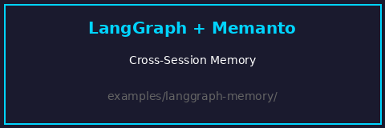

# LangGraph + Memanto Example

This directory contains a real-world example of **LangGraph** agents using **Memanto** as their shared, persistent memory layer. Two agents collaborate through a semantic memory database that survives across sessions, agent runs, and checkpoints.

> **Note**: The core integration tools used in this example are published to PyPI as `memanto`. For deep documentation on the architecture, setup instructions, and API details, please read the [memanto package documentation](https://github.com/moorcheh-ai/memanto).

## Architecture

## 30-Second Demo



This animation shows the complete cross-session memory flow:
1. Researcher Agent stores findings via `memanto_remember()`
2. Session ends (new session starts)
3. Writer Agent retrieves memories via `memanto_recall()`
4. Cross-session persistence confirmed!


## What This Demonstrates

- **Cross-agent memory sharing**: A Research Agent stores findings that a Writer Agent retrieves
- **Cross-session persistence**: Run the researcher today, the writer tomorrow — memories persist
- **Typed semantic memory**: 13 memory types (fact, observation, decision, etc.) with confidence scoring
- **Stateful pipelines**: LangGraph checkpoints preserve conversation state across turns

## Prerequisites

- Python 3.10+
- A [Moorcheh API key](https://console.moorcheh.ai/api-keys) (free tier: 100K ops/month)
- An [OpenRouter API key](https://openrouter.ai/keys) (for the LLM — free tier available)

## Setup

```bash
python -m venv venv
source venv/bin/activate
pip install -r requirements.txt
cp .env.example .env
# Edit .env and add your MOORCHEH_API_KEY and OPENROUTER_API_KEY
```

## Step-by-Step Demo (Proves Persistence)

```bash
# Step 1: Research Agent stores findings in Memanto
python run_research.py

# Step 2: Writer Agent retrieves those memories in a NEW session
python run_writer.py
```

## Offline Validation

```bash
python validate_offline.py
```

## File Structure

```text
examples/langgraph-memanto/
├── README.md                  # This file
├── requirements.txt           # Python dependencies
├── .env.example               # API key template
├── .gitignore                 # Keeps local keys and virtualenvs out of git
├── validate_offline.py        # Standard-library structural smoke test
├── langgraph_memanto/
│   ├── __init__.py
│   ├── state.py               # Shared LangGraph state schema
│   ├── nodes.py               # Agent node definitions
│   ├── memory_tools.py        # LangGraph-native Memanto tools
│   └── graph.py               # Graph definition + compilation
├── run_research.py             # Run 1: Research Agent stores findings
├── run_writer.py               # Run 2: Writer Agent recalls memories
└── run_full_pipeline.py        # Full pipeline in one run
```

## How It Works

### State Schema

The shared `ResearchState` holds both the conversation trace and the Memanto agent ID:

```python
class ResearchState(TypedDict):
    messages: List[BaseMessage]
    memanto_agent_id: str
    research_topic: str
    findings: List[str]
```

### Memory Tools

`memory_tools.py` wraps the Memanto SDK as pure functions (no class inheritance),
compatible with LangGraph's function-based node model:

- `memanto_remember(state, memory_type, title, content, tags)` → stores a memory
- `memanto_recall(state, query, limit)` → searches memories
- `memanto_answer(state, question)` → RAG over stored memories

### Graph Structure

```text
research_graph:
  topic → [research_agent] → remember_findings → writer_agent → recall_findings → done
                         ↑                      ↓
                         └────── memories ──────┘
```

The graph uses a **Memanto agent ID** (`langgraph-research-team`) as the shared
memory namespace, giving both the researcher and writer access to the same memories.

## Bonus: Cursor Integration

After running the LangGraph pipeline, you can access the same memories from Cursor:

```bash
memanto connect cursor --global
```

Open any project in Cursor and ask it to recall research findings — it accesses
the same Memanto memory namespace used by the LangGraph agents.
